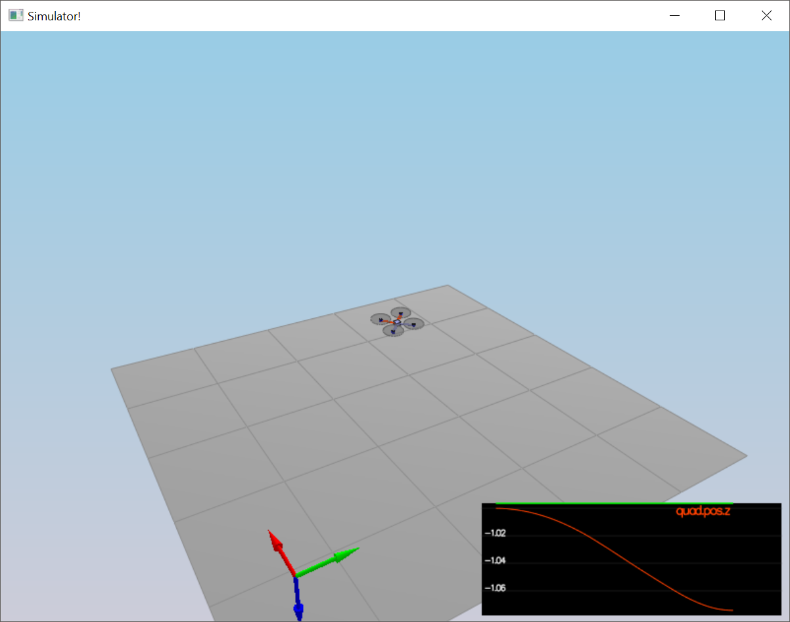
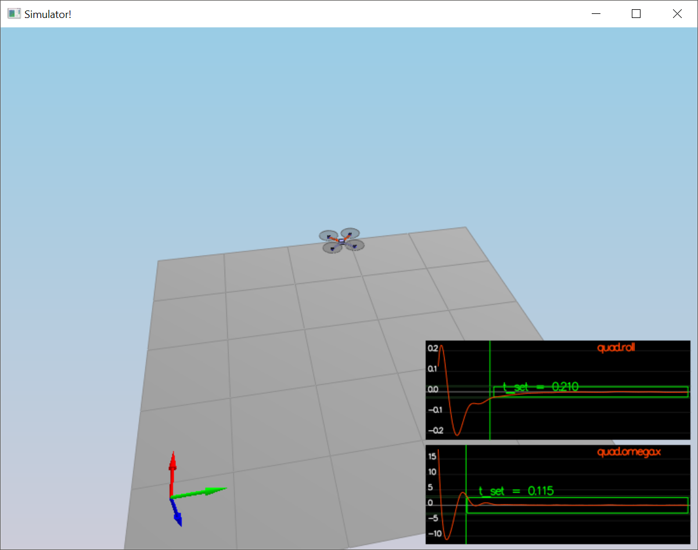
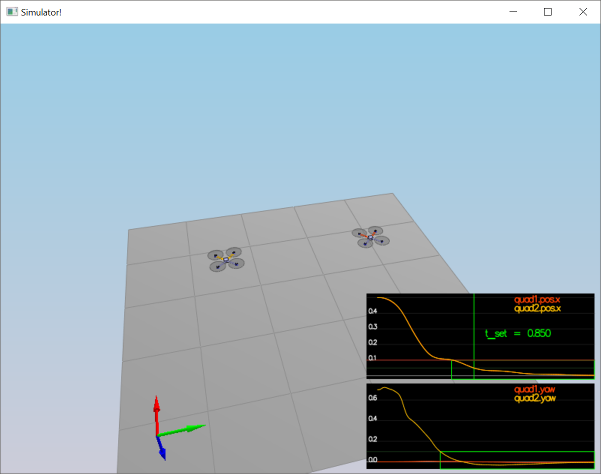
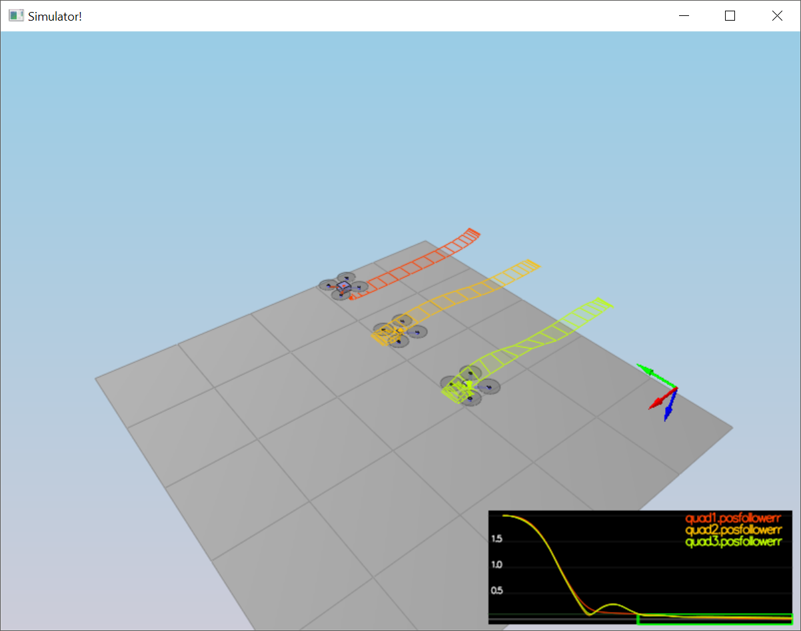
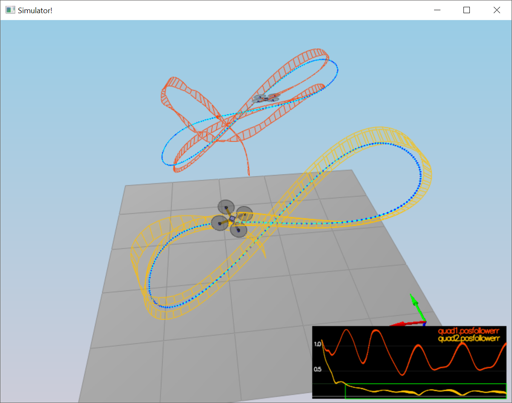

# Flying Car C++ Controller Project Writeup

## Implemented body rate control in C++

Body Rate Controller is responsible for calculating 3-moment (x, y, z) in body frame given desired and current body rates.

This controller is straightforward to implement, it is a proportional to body rates error multiplied by moments of inertia for each axis that are pre-defined for a vehicle.

```cpp
V3F I;
I.x = Ixx;
I.y = Iyy;
I.z = Izz;

momentCmd = I * kpPQR * (pqrCmd - pqr);
```

## Implement roll pitch control in C++

Roll/Pitch Controller calculates pitch and roll angles based on desired acceleration, attitude and collective thrust.

This is P controller that uses the same code from lecture lecture exercise.

```cpp
if (collThrustCmd == 0) {
    return pqrCmd;
}

float collAccel = -collThrustCmd / mass;

float bXCmd = CONSTRAIN(accelCmd.x / collAccel, -maxTiltAngle, maxTiltAngle);
float bXErr = bXCmd - R(0, 2);

float bYCmd = CONSTRAIN(accelCmd.y / collAccel, -maxTiltAngle, maxTiltAngle);
float bYErr = bYCmd - R(1, 2);

float bXPTerm = kpBank * bXErr;
float bYPTerm = kpBank * bYErr;

Mat3x3F R1;
float r11 = R(1, 0) / R(2, 2);
float r12 = -R(0, 0) / R(2, 2);
float r21 = R(1, 1) / R(2, 2);
float r22 = -R(0, 1) / R(2, 2);

pqrCmd.x = r11 * bXPTerm + r12 * bYPTerm;
pqrCmd.y = r21 * bXPTerm + r22 * bYPTerm;
```

## Implement altitude controller in C++

Altitude Controller calculates thrust based on desired altitude and velocity and actual altitude and velocity.

This is PID controller that uses the same code from lecture lecture exercise. The only difference is that we return force and not acceleration, and constrain min/max acceleration rates by diffentiating maxAscentRate (maxAscentRate/dt).

```cpp
float posZErr = posZCmd - posZ;
float velZErr = velZCmd - velZ;
integratedAltitudeError += posZErr * dt;

float bZ = R(2, 2);

float pTerm = kpPosZ * posZErr;
float dTerm = kpVelZ * velZErr;
float iTerm = KiPosZ * integratedAltitudeError;

float u1Bar = pTerm + iTerm + dTerm + accelZCmd;

float acc = (u1Bar - 9.81f) / bZ;
thrust = -mass * CONSTRAIN(acc, -maxAscentRate / dt, maxAscentRate / dt);
```

## Implement lateral position control in C++

Lateral Controller calculates horizontal accelertion based on desired alteral position/velocity/acceleration and current position.

This is PI controller that uses the same code from lecture lecture exercise.

```cpp
V3F posErr = posCmd - pos;
V3F velErr = velCmd - vel;

V3F accelerations = kpPosXY * posErr + kpVelXY * velErr + accelCmdFF;
accelCmd.x = accelerations.x;
accelCmd.y = accelerations.y;
```

## Implement yaw control in C++

Yaw Controller Calculates desired yaw rate base on desired and actual yaw angles.

This is P controller.

```cpp
yawRateCmd = kpYaw * (yawCmd - yaw);
```

## Implement calculating the motor commands given commanded thrust and moments in C++

Motor Thrust Controller calculates individual motor commands based cullective thrust and desired 3-moment command.

To get individual thrusts, solve system of equations:

(1) t1 + t2 + t3 + t4 = T
(2) t1 + t4 - t2 - t3 = moment[x] * sqrt(2)*L
(3) t1 + t2 - t3 - t4 = moment[y] * sqrt(2)*L
(4) t1 + t2 - t2 - t4 = moment[y]

The following code is based on lecture notes:

```cpp
l = L / sqrtf(2.f);
float t1 = momentCmd.x / l;
float t2 = momentCmd.y / l;
float t3 = -momentCmd.z / kappa;
float t4 = collThrustCmd;

cmd.desiredThrustsN[0] = (t1 + t2 + t3 + t4) / 4.f;  // front left  - f1
cmd.desiredThrustsN[1] = (-t1 + t2 - t3 + t4) / 4.f; // front right - f2
cmd.desiredThrustsN[2] = (t1 - t2 - t3 + t4) / 4.f; // rear left   - f4
cmd.desiredThrustsN[3] = (-t1 - t2 + t3 + t4) / 4.f; // rear right  - f3
```

## Your C++ controller is successfully able to fly the provided test trajectory and visually passes inspection of the scenarios leading up to the test trajectory

The correct way to implement and tune controllers:

### Scenario 1: Intro

Tune m parameter until drone stays in place. This scenario using very basic Motor Thrust Controller that equaly distributes thrust to 4 motors.



### Scenario 2: Attitude Controll

This scenario needs 3 controllers implemented. Tricky part is to tune controller parameters so that UAV doesn't flip and is able to gain altitude.

1. Motor Thrust Controller
2. Roll/Pitch Controller
3. Altitude Controller



### Scenario 3: Position Control

This scenario adds two controller to the stack of used controllers.

1. Body Rate Controller
2. Lateral Position Controller



### Scenario 4: Non-Linerities

Non-linearities in trjectory are ruled using integral part in Altitude Controller.



### Scenario 5: Trajectory Follow

Tune knobs until drone is able to fly a 8-shaped trajectory.

